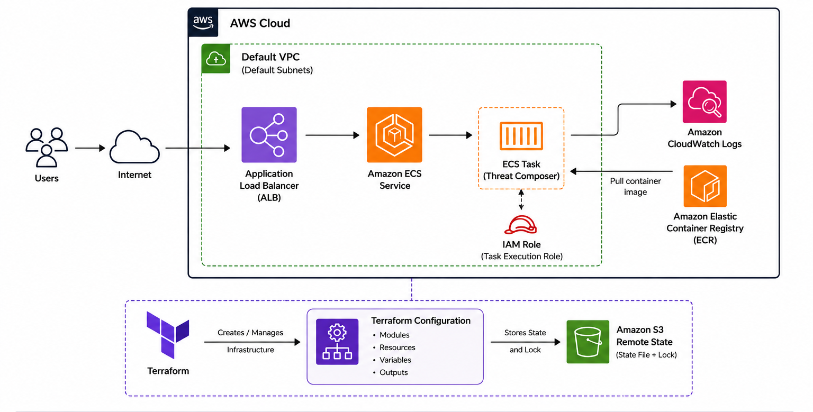

# Threat Composer

Threat Composer is a containerised web application for creating and managing cyber threat models.

The application enables users to create, edit and visualise cyber threat models through an intuitive web interface, providing a structured way to document assets, threats and security considerations during the design of a system.

This repository contains both the application source code and the Terraform infrastructure used to provision and deploy the application to AWS using Infrastructure as Code (IaC).

---

## Why this project?

This project was created to gain practical experience designing, building and managing cloud infrastructure using Terraform and AWS.

Rather than provisioning resources manually through the AWS Management Console, all infrastructure is defined declaratively using Infrastructure as Code, making deployments repeatable, version-controlled and easier to maintain.

---

## Overview

The infrastructure provisions the AWS resources required to deploy and run Threat Composer using Amazon ECS Fargate.

The solution includes:

- Amazon ECS Fargate
- Application Load Balancer (ALB)
- Amazon Elastic Container Registry (ECR)
- Amazon CloudWatch Logs
- AWS Identity and Access Management (IAM)
- Security Groups
- Amazon S3 Remote Terraform State

The Terraform configuration follows industry best practices, including:

- Modular architecture
- Reusable Terraform modules
- Remote state management
- Input validation
- Least-privilege IAM permissions

---

## Architecture

The diagram below illustrates the high-level AWS architecture used to deploy the Threat Composer application.



---

## Project Structure

```text
.
├── app/                    # Threat Composer application
├── infra/                  # Terraform infrastructure
│   ├── modules/
│   │   └── ecs/
│   ├── alb.tf
│   ├── backend.tf
│   ├── ecs.tf
│   ├── iam.tf
│   ├── networking.tf
│   ├── outputs.tf
│   ├── providers.tf
│   ├── security-groups.tf
│   └── variables.tf
│
├── bootstrap/              # Terraform backend bootstrap configuration
│
├── .gitignore
└── README.md
```

---

## Technologies

- Terraform
- AWS ECS Fargate
- Amazon Elastic Container Registry (ECR)
- Application Load Balancer (ALB)
- Amazon CloudWatch
- AWS Identity and Access Management (IAM)
- Amazon S3
- Docker

---

## Features

- Infrastructure managed entirely with Terraform
- Modular Terraform project structure
- Containerised application deployment using Amazon ECS Fargate
- Application Load Balancer for traffic distribution
- CloudWatch logging for container monitoring
- IAM roles managed through Terraform
- Secure networking using Security Groups
- Remote Terraform state stored in Amazon S3
- State locking to support collaborative infrastructure management
- Input validation for Terraform variables

---

## Deployment

Terraform can be used to provision the infrastructure from the `infra` directory.

Initialise Terraform:

```bash
terraform init
```

Review the execution plan:

```bash
terraform plan
```

Deploy the infrastructure:

```bash
terraform apply
```

Once deployment completes, Terraform outputs the Application Load Balancer DNS name, which can be used to access the application.

---

## Lessons Learned

Building this project provided practical experience with:

- Designing reusable Terraform modules
- Managing remote Terraform state
- Applying Infrastructure as Code best practices
- Managing AWS IAM resources with Terraform
- Deploying containerised workloads to Amazon ECS Fargate
- Designing secure AWS networking using Security Groups
- Structuring production-style Terraform projects
- Deploying container images from Amazon ECR

---

## Future Improvements

Potential future enhancements include:

- CI/CD pipeline using GitHub Actions
- HTTPS support with AWS Certificate Manager
- Route 53 custom domain
- ECS Auto Scaling
- Multi-environment deployments (development, staging and production)
- CloudWatch dashboards and monitoring
- Blue/Green deployment strategy